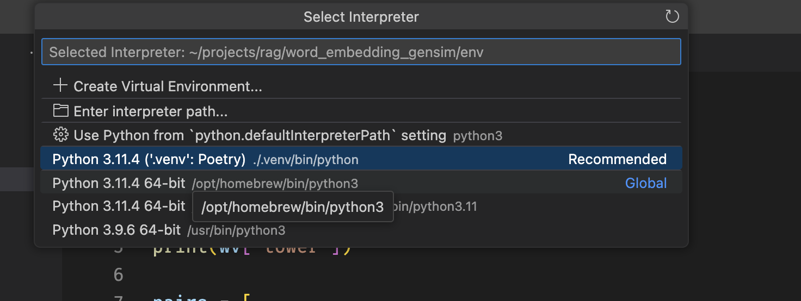

## setup

### install python package manager

- install `python 3.12` (use home brew) and include in current path

```
brew install python@3.12
```

- install uv for virtual environments

```
curl -LsSf https://astral.sh/uv/install.sh | sh
```

- create a virtual environment at .venv

```
 uv venv
```

- activate venv

```
source .venv/bin/activate
```

- install poetry to manage packages

```
uv pip install poetry
```

- validate that install paths look ok i.e.

```
which python3 # e.g. /Users/username/learn-llm/.venv/bin/python3
which poetry # e.g. /Users/username/learn-llm/.venv/bin/poetry
```

- install all dependencies from pyproject.toml

```
poetry install
```

- to run python from vscode, select interpreter in `vscode` (cmd+shift+p -> select interpretor)
  
